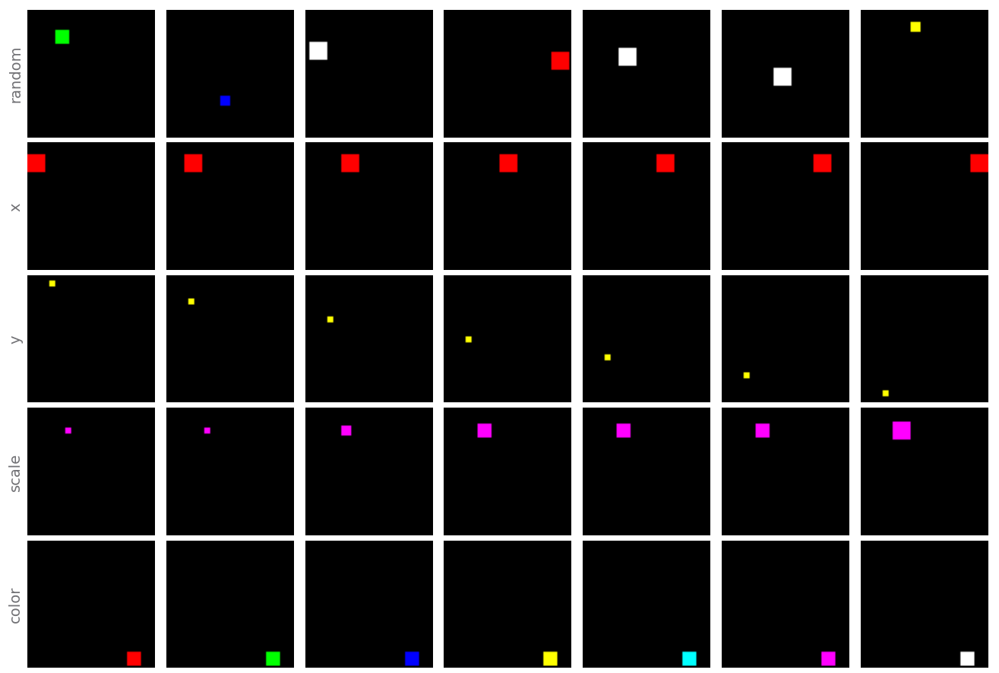

<p align="center">
    <h1 align="center">🧶 Disent</h1>
    <p align="center">
        <i>A modular disentangled representation learning framework built with PyTorch Lightning</i>
    </p>
</p>

<p align="center">
    <a href="https://choosealicense.com/licenses/mit/">
        
    </a>
    <a href="https://pypi.org/project/disent">
        
    </a>
    <a href="https://pypi.org/project/disent">
        
    </a>
    <a href="https://github.com/nmichlo/disent/actions?query=workflow%3Atest">
        
    </a>
<!--     <a href="https://codecov.io/gh/nmichlo/disent/"> -->
<!--          -->
<!--     </a> -->
<!--     <a href="https://github.com/nmichlo/disent"> -->
<!--          -->
<!--     </a> -->
</p>

<p align="center">
    <p align="center">
        Visit the <a href="https://disent.dontpanic.sh/">docs</a> for more info, or browse the  <a href="https://github.com/nmichlo/disent/releases">releases</a>.
    </p>
    <p align="center">
        <a href="https://github.com/nmichlo/disent/issues/new/choose">Contributions</a> are welcome!
    </p>
</p>

----------------------

## Table Of Contents

- [Overview](#overview)
- [Features](#features)
    * [Frameworks](#frameworks)
    * [Metrics](#metrics)
    * [Datasets](#datasets)
    * [Schedules & Annealing](#schedules--annealing)
- [Examples](#examples)
    * [Python Example](#python-example)
    * [Hydra Config Example](#hydra-config-example)
- [Why?](#why)

----------------------

## Overview

Disent is a modular disentangled representation learning framework for auto-encoders,
built upon PyTorch-Lightning. This framework consists of various composable components
that can be used to build and benchmark various disentanglement vision tasks.

> The name of the framework is derived from both **disent**anglement and scientific **dissent**.

Get started with disent by installing it with $`pip install disent` or cloning this repository.

### Goals

Disent aims to fill the following criteria:
1. Provide **high quality**, **readable**, **consistent** and **easily comparable** implementations of frameworks
2. **Highlight difference** between framework implementations by overriding **hooks** and minimising duplicate code 
3. Use **best practice** eg. `torch.distributions`
4. Be extremely **flexible** & configurable
5. Support low memory systems

### Citing Disent

Please use the following citation if you use Disent in your own research:

```bibtex
@Misc{Michlo2021Disent,
  author =       {Nathan Juraj Michlo},
  title =        {Disent - A modular disentangled representation learning framework for pytorch},
  howpublished = {Github},
  year =         {2021},
  url =          {https://github.com/nmichlo/disent}
}
```

----------------------

## Architecture

The disent directory structure:

- `disent/dataset`: dataset wrappers, datasets & sampling strategies
    + `disent/dataset/data`: raw datasets
    + `disent/dataset/sampling`: sampling strategies for `DisentDataset`
- `disent/framework`: frameworks, including Auto-Encoders and VAEs
- `disent/metric`: metrics for evaluating disentanglement using ground truth datasets
- `disent/model`: common encoder and decoder models used for VAE research
- `disent/nn`: torch components for building models including layers, transforms, losses and general maths
- `disent/schedule`: annealing schedules that can be registered to a framework
- `disent/util`: helper classes, functions, callbacks, anything unrelated to a pytorch system/model/framework.

**Please Note The API Is Still Unstable ⚠️**

Disent is still under active development. Features and APIs are mostly stable but may change! A limited
set of tests currently exist which will be expanded upon in time.

**Hydra Experiment Directories**

Easily run experiments with hydra config, these files
are not available from `pip install`.

- `experiment/run.py`: entrypoint for running basic experiments with [hydra](https://github.com/facebookresearch/hydra) config
- `experiment/config`: root folder for [hydra](https://github.com/facebookresearch/hydra) config files
- `experiment/util`: various helper code for experiments

----------------------

## Features

Disent includes implementations of modules, metrics and
datasets from various papers. Please note that items marked
  with a "🧵" are introduced in and are unique to disent!

### Frameworks
- **Unsupervised**:
  + [VAE](https://arxiv.org/abs/1312.6114)
  + [Beta-VAE](https://openreview.net/forum?id=Sy2fzU9gl)
  + [DFC-VAE](https://arxiv.org/abs/1610.00291)
  + [DIP-VAE](https://arxiv.org/abs/1711.00848)
  + [InfoVAE](https://arxiv.org/abs/1706.02262)
  + [BetaTCVAE](https://arxiv.org/abs/1802.04942)
- **Weakly Supervised**:
  + [Ada-GVAE](https://arxiv.org/abs/2002.02886) *`AdaVae(..., average_mode='gvae')`* Usually better than the Ada-ML-VAE
  + [Ada-ML-VAE](https://arxiv.org/abs/2002.02886) *`AdaVae(..., average_mode='ml-vae')`*
- **Supervised**:
  + [TVAE](https://arxiv.org/abs/1802.04403)

Many popular disentanglement frameworks still need to be added, please
submit an issue if you have a request for an additional framework.

<details><summary><b>todo</b></summary><p>

+ FactorVAE
+ GroupVAE
+ MLVAE

</p></details>

### Metrics
- **Disentanglement**:
  + [FactorVAE Score](https://arxiv.org/abs/1802.05983)
  + [DCI](https://openreview.net/forum?id=By-7dz-AZ)
  + [MIG](https://arxiv.org/abs/1802.04942)
  + [SAP](https://arxiv.org/abs/1711.00848)
  + [Unsupervised Scores](https://github.com/google-research/disentanglement_lib)

Some popular metrics still need to be added, please submit an issue if you wish to
add your own, or you have a request.

<details><summary><b>todo</b></summary><p>

+ [DCIMIG](https://arxiv.org/abs/1910.05587)
+ [Modularity and Explicitness](https://arxiv.org/abs/1802.05312)

</p></details>

### Datasets

Various common datasets used in disentanglement research are included, with hash
verification and automatic chunk-size optimization of underlying hdf5 formats for
low-memory disk-based access.

- **Ground Truth**:
  + Cars3D
  + dSprites
  + MPI3D
  + SmallNORB
  + Shapes3D

- **Ground Truth Synthetic**:
  + 🧵 XYObject: *A simplistic version of dSprites with a single square.*

  <p align="center">
    
  </p>

  #### Input Transforms + Input/Target Augmentations
  
  - Input based transforms are supported.
  - Input and Target CPU and GPU based augmentations are supported.

### Schedules & Annealing

Hyper-parameter annealing is supported through the use of schedules.
The currently implemented schedules include:

- Linear Schedule
- [Cyclic](https://arxiv.org/abs/1903.10145) Schedule
- Cosine Wave Schedule
- *Various other wrapper schedules*

----------------------

## Examples

### Python Example

The following is a basic working example of disent that trains a BetaVAE with a cyclic
beta schedule and evaluates the trained model with various metrics.

<details><summary><b>Basic Example</b></summary>
<p>

```python3
import os
import pytorch_lightning as pl
import torch
from torch.optim import Adam
from torch.utils.data import DataLoader
from disent.dataset import DisentDataset
from disent.dataset.data import XYObjectData
from disent.dataset.sampling import SingleSampler
from disent.frameworks.vae import BetaVae
from disent.metrics import metric_dci, metric_mig
from disent.model import AutoEncoder
from disent.model.ae import DecoderConv64, EncoderConv64
from disent.nn.transform import ToStandardisedTensor
from disent.schedule import CyclicSchedule

# create the dataset & dataloaders
# - ToStandardisedTensor transforms images from numpy arrays to tensors and performs checks
data = XYObjectData()
dataset = DisentDataset(dataset=data, sampler=SingleSampler(), transform=ToStandardisedTensor())
dataloader = DataLoader(dataset=dataset, batch_size=128, shuffle=True, num_workers=os.cpu_count())

# create the BetaVAE model
# - adjusting the beta, learning rate, and representation size.
module = BetaVae(
  model=AutoEncoder(
    # z_multiplier is needed to output mu & logvar when parameterising normal distribution
    encoder=EncoderConv64(x_shape=data.x_shape, z_size=10, z_multiplier=2),
    decoder=DecoderConv64(x_shape=data.x_shape, z_size=10),
  ),
  cfg=BetaVae.cfg(
    optimizer='adam', optimizer_kwargs=dict(lr=1e-3),
    loss_reduction='mean_sum', beta=4,
  )
)

# cyclic schedule for target 'beta' in the config/cfg. The initial value from the
# config is saved and multiplied by the ratio from the schedule on each step.
# - based on: https://arxiv.org/abs/1903.10145
module.register_schedule(
  'beta', CyclicSchedule(
    period=1024,  # repeat every: trainer.global_step % period
  )
)

# train model
# - for 2048 batches/steps
trainer = pl.Trainer(max_steps=2048, gpus=1 if torch.cuda.is_available() else None, logger=False, checkpoint_callback=False)
trainer.fit(module, dataloader)

# compute disentanglement metrics
# - we cannot guarantee which device the representation is on
# - this will take a while to run
get_repr = lambda x: module.encode(x.to(module.device))

metrics = {
  **metric_dci(dataset, get_repr, num_train=1000, num_test=500, show_progress=True),
  **metric_mig(dataset, get_repr, num_train=2000),
}

# evaluate
print('metrics:', metrics)
```

</p>
</details>

Visit the [docs](https://disent.dontpanic.sh) for more examples!


### Hydra Config Example

The entrypoint for basic experiments is `experiment/run.py`.

Some configuration will be required, but basic experiments can
be adjusted by modifying the [Hydra Config 1.0](https://github.com/facebookresearch/hydra)
files in `experiment/config` (Please note that hydra 1.1 is not yet supported).

Modifying the main `experiment/config/config.yaml` is all you
need for most basic experiments. The main config file contains
a defaults list with entries corresponding to yaml configuration
files (config options) in the subfolders (config groups) in
`experiment/config/<config_group>/<option>.yaml`.

<details><summary><b>Config Defaults Example</b></summary>
<p>

```yaml
defaults:
  # system
  - framework: adavae
  - model: vae_conv64
  - optimizer: adam
  - schedule: none
  # data
  - dataset: xyobject
  - dataset_sampling: full_bb
  - augment: none
  # runtime
  - metrics: fast
  - run_length: short
  - run_location: local
  - run_callbacks: vis
  - run_logging: wandb

# <rest of config.yaml left out>
...
```

</p>
</details>

Easily modify  any of these values to adjust how the basic experiment
will be run. For example, change `framework: adavae` to `framework: betavae`, or
change the dataset from `xyobject` to `shapes3d`. Add new options by adding new
yaml files in the config group folders.

[Weights and Biases](https://docs.wandb.ai/quickstart) is supported by changing `run_logging: none` to
`run_logging: wandb`. However, you will need to login from the command line. W&B logging supports
visualisations of latent traversals.


----------------------

### Why?
  
- Created as part of my Computer Science MSc scheduled for completion in 2021.
- I needed custom high quality implementations of various VAE's.
- A pytorch version of [disentanglement_lib](https://github.com/google-research/disentanglement_lib).
- I didn't have time to wait for [Weakly-Supervised Disentanglement Without Compromises](https://arxiv.org/abs/2002.02886) to release
  their code as part of disentanglement_lib. (As of September 2020 it has been released, but has unresolved [discrepencies](https://github.com/google-research/disentanglement_lib/issues/31)).
- disentanglement_lib still uses outdated Tensorflow 1.0, and the flow of data is unintuitive because of its use of [Gin Config](https://github.com/google/gin-config).

----------------------
