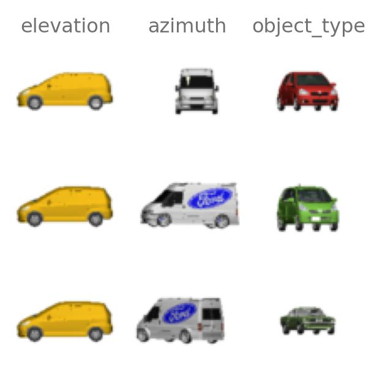
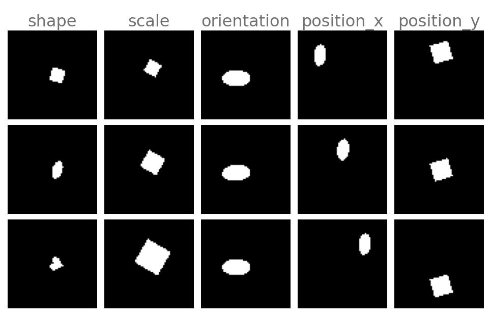
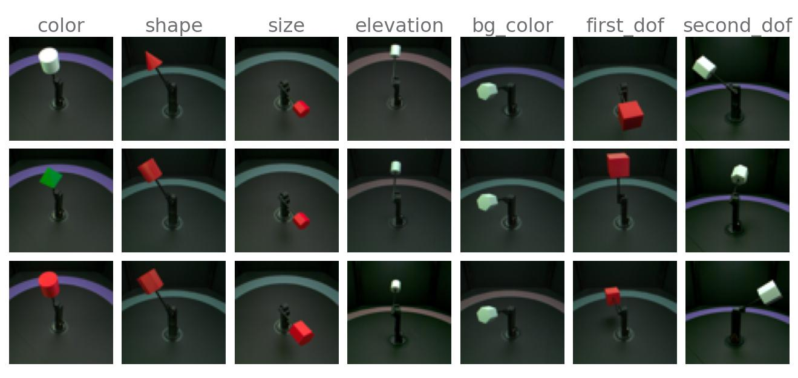
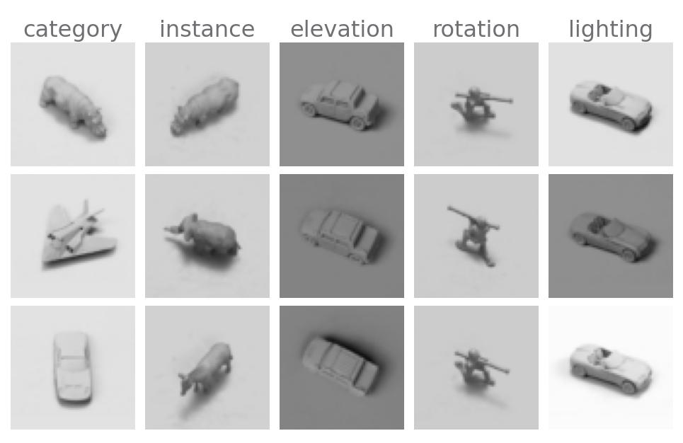
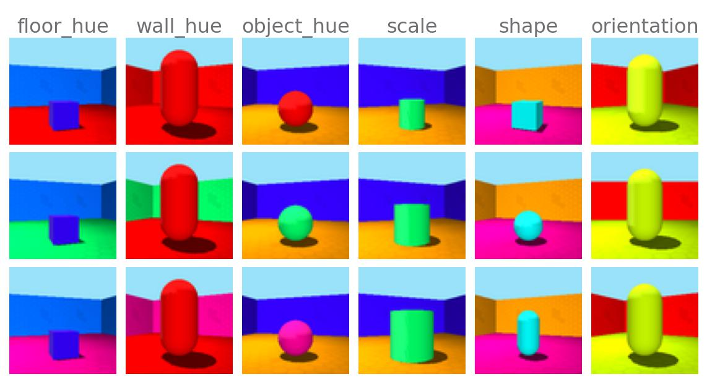
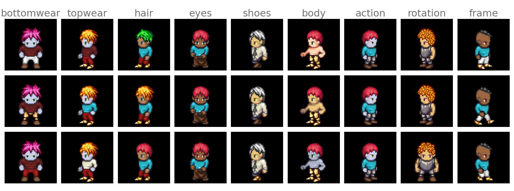
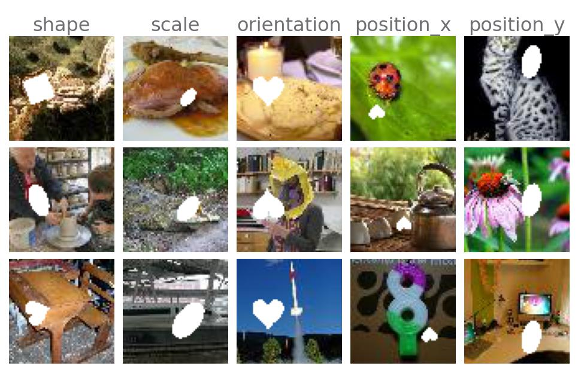
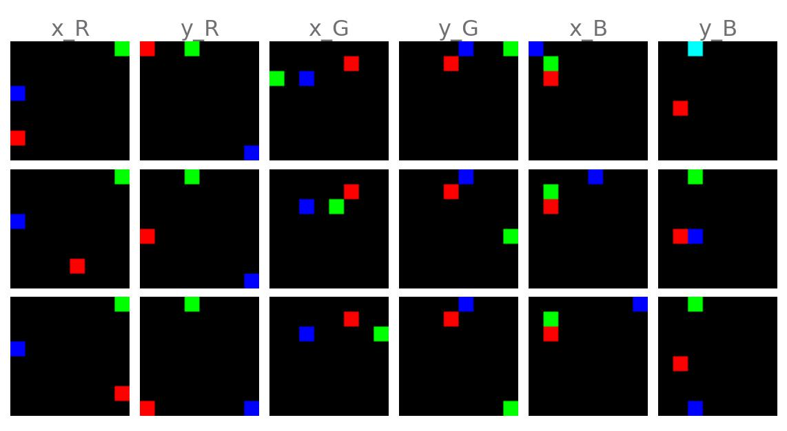
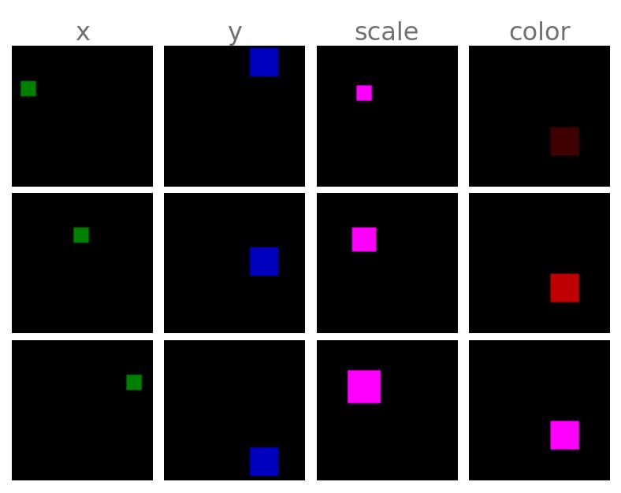
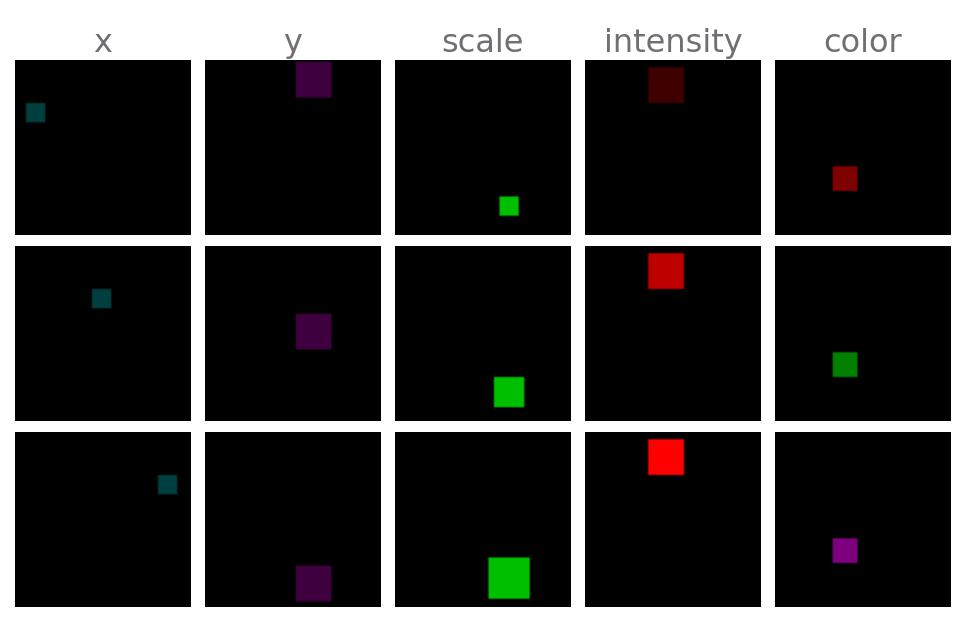

<p align="center">
    <h1 align="center">🧶 Disent</h1>
    <p align="center">
        <i>A modular disentangled representation learning framework built with PyTorch Lightning</i>
    </p>
</p>

<p align="center">
    <a href="https://choosealicense.com/licenses/mit/" target="_blank">
        
    </a>
    <a href="https://pypi.org/project/disent" target="_blank">
        
    </a>
    <a href="https://pypi.org/project/disent" target="_blank">
        
    </a>
    <a href="https://github.com/nmichlo/disent/actions?query=workflow%3Atest">
        
    </a>
<!--     <a href="https://codecov.io/gh/nmichlo/disent/"> -->
<!--          -->
<!--     </a> -->
<!--     <a href="https://github.com/nmichlo/disent"> -->
<!--          -->
<!--     </a> -->
</p>

<p align="center">
    <p align="center">
        Visit the <a href="https://disent.dontpanic.sh/" target="_blank">docs</a> for more info, or browse the  <a href="https://github.com/nmichlo/disent/releases">releases</a>.
    </p>
    <p align="center">
        <a href="https://github.com/nmichlo/disent/issues/new/choose">Contributions</a> are welcome!
    </p>
</p>

<p align="center">
    ────────────────
    <br/>
    <i><b> NOTE:</b> My MSc. research has moved <a href="https://github.com/nmichlo/msc-research">here</a></i>
    <br/>
    <i>Some of the contributions have been incorporated directly into disent</i>
    <br/>
    ────────────────
</p>

----------------------

## Table Of Contents

- [Overview](#overview)
- [Features](#features)
    * [Datasets](#datasets)
    * [Frameworks](#frameworks)
    * [Metrics](#metrics)
    * [Schedules & Annealing](#schedules--annealing)
- [Architecture](#architecture)
- [Examples](#examples)
    * [Python Example](#python-example)
    * [Hydra Config Example](#hydra-config-example)
- [Why?](#why)

----------------------

## Overview

Disent is a modular disentangled representation learning framework for auto-encoders,
built upon PyTorch-Lightning. This framework consists of various composable components
that can be used to build and benchmark various disentanglement vision tasks.

> The name of the framework is derived from both **disent**anglement and scientific **dissent**.

Get started with disent by installing it with $`pip install disent` or cloning this repository.

### Goals

Disent aims to fill the following criteria:
1. Provide **high quality**, **readable**, **consistent** and **easily comparable** implementations of frameworks
2. **Highlight difference** between framework implementations by overriding **hooks** and minimising duplicate code 
3. Use **best practice** eg. `torch.distributions`
4. Be extremely **flexible** & configurable
5. Support low memory systems

### Citing Disent

Please use the following citation if you use Disent in your own research:

```bibtex
@Misc{Michlo2021Disent,
  author =       {Nathan Juraj Michlo},
  title =        {Disent - A modular disentangled representation learning framework for pytorch},
  howpublished = {Github},
  year =         {2021},
  url =          {https://github.com/nmichlo/disent}
}
```

----------------------

## Features

Disent includes implementations of modules, metrics and
datasets from various papers.

_Note that "🧵" means that the dataset, framework or metric was introduced by disent!_

### Datasets

Various common datasets used in disentanglement research are included with disent. The dataset loaders provide various features including:
- automatic downloads & preperation `prepare=True`
- automatic hash verification
- automatic optimization of underlying hdf5 formats for
low-memory disk-based access.

Data input and target dataset augmentations and transforms are supported, as well as augmentations
on the GPU or CPU at different points in the pipeline.

- **Ground Truth**:
  + <details>
    <summary>🚗 <a href="https://papers.nips.cc/paper/5845-deep-visual-analogy-making" target="_blank">Cars3D</a></summary>
    <p align="center"></p>
  </details>

  + <details>
    <summary>◻️ <a href="https://github.com/deepmind/dsprites-dataset" target="_blank">dSprites</a></summary>
    <p align="center"></p>
  </details>

  + <details>
    <summary>🔺 <a href="https://arxiv.org/abs/1906.03292" target="_blank">MPI3D</a></summary>
    <p align="center"></p>
  </details>

  + <details>
    <summary>🐘 <a href="https://cs.nyu.edu/~ylclab/data/norb-v1.0-small/" target="_blank">SmallNORB</a></summary>
    <p align="center"></p>
  </details>

  + <details>
    <summary>🌈 <a href="https://github.com/deepmind/3d-shapes" target="_blank">Shapes3D</a></summary>
    <p align="center"></p>
  </details>

  + <details>
    <summary>🏹 <a href="https://github.com/YingzhenLi/Sprites" target="_blank">Sprites (custom)</a></summary>
    <p align="center"></p>
  </details>

  + <details open>
    <summary>
      🧵 <u>dSpritesImagenet</u>:
      <i>Version of DSprite with foreground or background deterministically masked out with tiny-imagenet data.</i>
    </summary>
    <p align="center"></p>
  </details>

- **Ground Truth Synthetic**:
  + <details open>
    <summary>
      🧵 <u>XYSquares</u>:
      <i>Three non-overlapping squares that can move around a grid. This dataset is adversarial to VAEs that use pixel-wise reconstruction losses.</i>
    </summary>
    <p align="center"></p>
  </details>

  + <details>
    <summary>
      🧵 <u>XYObject</u>:
      <i>A simplistic version of dSprites with a single square.</i>
    </summary>
    <p align="center"></p>
  </details>

  + <details open>
    <summary>
      🧵 <u>XYObjectShaded</u>:
      <i>Exact same dataset as XYObject, but ground truth factors have a different representation.</i>
    </summary>
    <p align="center"></p>
  </details>

### Frameworks

Disent provides the following Auto-Encoders and Variational Auto-Encoders!

- **Unsupervised**:
  + <u>AE</u>: _Auto-Encoder_
  + [VAE](https://arxiv.org/abs/1312.6114): Variational Auto-Encoder
  + [Beta-VAE](https://openreview.net/forum?id=Sy2fzU9gl): VAE with Scaled Loss
  + [DFC-VAE](https://arxiv.org/abs/1610.00291): Deep Feature Consistent VAE
  + [DIP-VAE](https://arxiv.org/abs/1711.00848): Disentangled Inferred Prior VAE
  + [InfoVAE](https://arxiv.org/abs/1706.02262): Information Maximizing VAE
  + [BetaTCVAE](https://arxiv.org/abs/1802.04942): Total Correlation VAE
- **Weakly Supervised**:
  + [Ada-GVAE](https://arxiv.org/abs/2002.02886): Adaptive GVAE, *`AdaVae.cfg(average_mode='gvae')`*, usually better than below!
  + [Ada-ML-VAE](https://arxiv.org/abs/2002.02886): Adaptive ML-VAE, *`AdaVae.cfg(average_mode='ml-vae')`*
- **Supervised**:
  + <u>TAE</u>: _Triplet Auto-Encoder_
  + [TVAE](https://arxiv.org/abs/1802.04403): Triplet Variational Auto-Encoder

Introduced in Disent

- **Unsupervised**:
  + 🧵 <u>Ada-TVAE-D</u>: Adaptive Triplet VAE that uses data distances instead of ground-truth distances as the supervision signal.
  + 🧵 <u>Ada-TAE-D</u>:  Adaptive Triplet AE that uses data distances instead of ground-truth distances as the supervision signal.
- **Weakly Supervised**:
  + 🧵 <u>Ada-AE</u>: Adaptive AE, the auto-encoder version of the Ada-GVAE
- **Supervised**:
  + 🧵 <u>Ada-TVAE</u>: Adaptive Triplet VAE, disentangled version of the TVAE
  + 🧵 <u>Ada-TAE</u>:  Adaptive Triplet AE, disentangled version of the TAE

<details><summary><b>🏗 Todo</b>: <i>Many popular disentanglement frameworks still need to be added, please
submit an issue if you have a request for an additional framework.</i></summary><p>

+ FactorVAE
+ GroupVAE
+ MLVAE

</p></details>

### Metrics
Various metrics are provided by disent that can be used to evaluate the
learnt representations of models that have been trained on ground-truth data. 

- **Disentanglement**:
  + [FactorVAE Score](https://arxiv.org/abs/1802.05983)
  + [DCI](https://openreview.net/forum?id=By-7dz-AZ)
  + [MIG](https://arxiv.org/abs/1802.04942)
  + [SAP](https://arxiv.org/abs/1711.00848)
  + [Unsupervised Scores](https://github.com/google-research/disentanglement_lib)
  + 🧵 <u>Flatness Components</u>: _Measures of the three components needed to learn factored representations from distances. VAEs often learn the first two (correlation & linearity), and the can happen accidentally (axis-alignment)!_
    - 🪡 <u>Ground-Truth Correlation</u> - _The spearman rank correlation between latent distances and ground-truth distances._
    - 🪡 <u>Linearity Ratio</u> - _How well factor traversals lie along an n-dimensional arbitrarily rotated line in the latent space_
    - 🪡 <u>Axis-Alignment Ratio</u> - _How well factor traversals are represented by a single latent variable, ie. an n-dimensional line that is axis-aligned._
  + 🧵 <u>Flatness Score</u> - _Measuring the max distance between factor traversal embeddings and the path length of their embeddings._

<details><summary><b>🏗 Todo</b>: <i>Some popular metrics still need to be added, please submit an issue if you wish to
add your own, or you have a request.</i></summary><p>

+ [DCIMIG](https://arxiv.org/abs/1910.05587)
+ [Modularity and Explicitness](https://arxiv.org/abs/1802.05312)

</p></details>

### Schedules & Annealing

Hyper-parameter annealing is supported through the use of schedules.
The currently implemented schedules include:

- Linear Schedule
- [Cyclic](https://arxiv.org/abs/1903.10145) Schedule
- Cosine Wave Schedule
- *Various other wrapper schedules*

----------------------

## Architecture

The disent module structure:

- `disent.dataset`: dataset wrappers, datasets & sampling strategies
    + `disent.dataset.data`: raw datasets
    + `disent.dataset.sampling`: sampling strategies for `DisentDataset` when multiple elements are required by frameworks, eg. for triplet loss
    + `disent.dataset.transform`: common data transforms and augmentations
    + `disent.dataset.wrapper`: wrapped datasets are no longer ground-truth datasets, these may have some elements masked out. We can still unwrap these classes to obtain the original datasets for benchmarking.
- `disent.frameworks`: frameworks, including Auto-Encoders and VAEs
    + `disent.frameworks.ae`: Auto-Encoder based frameworks
    + `disent.frameworks.vae`: Variational Auto-Encoder based frameworks
- `disent.metrics`: metrics for evaluating disentanglement using ground truth datasets
- `disent.model`: common encoder and decoder models used for VAE research
- `disent.nn`: torch components for building models including layers, transforms, losses and general maths
- `disent.schedule`: annealing schedules that can be registered to a framework
- `disent.util`: helper classes, functions, callbacks, anything unrelated to a pytorch system/model/framework.

**⚠️ The API Is _Mostly_ Stable ⚠️**

Disent is still under development. Features and APIs are subject to change!
However, I will try and minimise the impact of these.

A small suite of tests currently exist which will be expanded upon in time.

**Hydra Experiment Directories**

Easily run experiments with hydra config, these files
are not available from `pip install`.

- `experiment/run.py`: entrypoint for running basic experiments with [hydra](https://github.com/facebookresearch/hydra) config
- `experiment/config/config.yaml`: main configuration file, this is probably what you want to edit!
- `experiment/config`: root folder for [hydra](https://github.com/facebookresearch/hydra) config files
- `experiment/util`: various helper code for experiments

**Extending The Default Configs**

All configs in `experiment/config` can easily be extended or overridden
without modifying any files. We can add a new config folder to the hydra search path
by setting the environment variable `DISENT_CONFIGS_PREPEND` to point to a config folder
that should take priority over those contained in the default folder.

The advantage of this is that new frameworks and datasets can be used with experiments without cloning or modifying
disent itself. You can separate your research code from the library!
- See the examples in the docs for more information!

----------------------

## Examples

### Python Example

The following is a basic working example of disent that trains a BetaVAE with a cyclic
beta schedule and evaluates the trained model with various metrics.

<details><summary><b>💾 Basic Example</b></summary>
<p>

```python3
import os
import pytorch_lightning as pl
import torch
from torch.utils.data import DataLoader

from disent.dataset import DisentDataset
from disent.dataset.data import XYObjectData
from disent.dataset.sampling import SingleSampler
from disent.dataset.transform import ToImgTensorF32
from disent.frameworks.vae import BetaVae
from disent.metrics import metric_dci
from disent.metrics import metric_mig
from disent.model import AutoEncoder
from disent.model.ae import DecoderConv64
from disent.model.ae import EncoderConv64
from disent.schedule import CyclicSchedule

# create the dataset & dataloaders
# - ToImgTensorF32 transforms images from numpy arrays to tensors and performs checks
data = XYObjectData()
dataset = DisentDataset(dataset=data, sampler=SingleSampler(), transform=ToImgTensorF32())
dataloader = DataLoader(dataset=dataset, batch_size=128, shuffle=True, num_workers=os.cpu_count())

# create the BetaVAE model
# - adjusting the beta, learning rate, and representation size.
module = BetaVae(
  model=AutoEncoder(
    # z_multiplier is needed to output mu & logvar when parameterising normal distribution
    encoder=EncoderConv64(x_shape=data.x_shape, z_size=10, z_multiplier=2),
    decoder=DecoderConv64(x_shape=data.x_shape, z_size=10),
  ),
  cfg=BetaVae.cfg(
    optimizer='adam',
    optimizer_kwargs=dict(lr=1e-3),
    loss_reduction='mean_sum',
    beta=4,
  )
)

# cyclic schedule for target 'beta' in the config/cfg. The initial value from the
# config is saved and multiplied by the ratio from the schedule on each step.
# - based on: https://arxiv.org/abs/1903.10145
module.register_schedule(
  'beta', CyclicSchedule(
    period=1024,  # repeat every: trainer.global_step % period
  )
)

# train model
# - for 2048 batches/steps
trainer = pl.Trainer(
  max_steps=2048, gpus=1 if torch.cuda.is_available() else None, logger=False, checkpoint_callback=False
)
trainer.fit(module, dataloader)

# compute disentanglement metrics
# - we cannot guarantee which device the representation is on
# - this will take a while to run
get_repr = lambda x: module.encode(x.to(module.device))

metrics = {
  **metric_dci(dataset, get_repr, num_train=1000, num_test=500, show_progress=True),
  **metric_mig(dataset, get_repr, num_train=2000),
}

# evaluate
print('metrics:', metrics)
```

</p>
</details>

Visit the [docs](https://disent.dontpanic.sh) for more examples!


### Hydra Config Example

The entrypoint for basic experiments is `experiment/run.py`.

Some configuration will be required, but basic experiments can
be adjusted by modifying the [Hydra Config 1.1](https://github.com/facebookresearch/hydra)
files in `experiment/config`.

Modifying the main `experiment/config/config.yaml` is all you
need for most basic experiments. The main config file contains
a defaults list with entries corresponding to yaml configuration
files (config options) in the subfolders (config groups) in
`experiment/config/<config_group>/<option>.yaml`.

<details><summary><b>💾 Config Defaults Example</b></summary>
<p>

```yaml
defaults:
  # data
  - sampling: default__bb
  - dataset: xyobject
  - augment: none
  # system
  - framework: adavae_os
  - model: vae_conv64
  # training
  - optimizer: adam
  - schedule: beta_cyclic
  - metrics: fast
  - run_length: short
  # logs
  - run_callbacks: vis
  - run_logging: wandb
  # runtime
  - run_location: local
  - run_launcher: local
  - run_action: train

# <rest of config.yaml left out>
...
```

</p>
</details>

Easily modify  any of these values to adjust how the basic experiment
will be run. For example, change `framework: adavae` to `framework: betavae`, or
change the dataset from `xyobject` to `shapes3d`. Add new options by adding new
yaml files in the config group folders.

[Weights and Biases](https://docs.wandb.ai/quickstart) is supported by changing `run_logging: none` to
`run_logging: wandb`. However, you will need to login from the command line. W&B logging supports
visualisations of latent traversals.


----------------------

### Why?
  
- Created as part of my Computer Science MSc which ended early 2022.
- I needed custom high quality implementations of various VAE's.
- A pytorch version of [disentanglement_lib](https://github.com/google-research/disentanglement_lib).
- I didn't have time to wait for [Weakly-Supervised Disentanglement Without Compromises](https://arxiv.org/abs/2002.02886) to release
  their code as part of disentanglement_lib. (As of September 2020 it has been released, but has unresolved [discrepencies](https://github.com/google-research/disentanglement_lib/issues/31)).
- disentanglement_lib still uses outdated Tensorflow 1.0, and the flow of data is unintuitive because of its use of [Gin Config](https://github.com/google/gin-config).

----------------------
